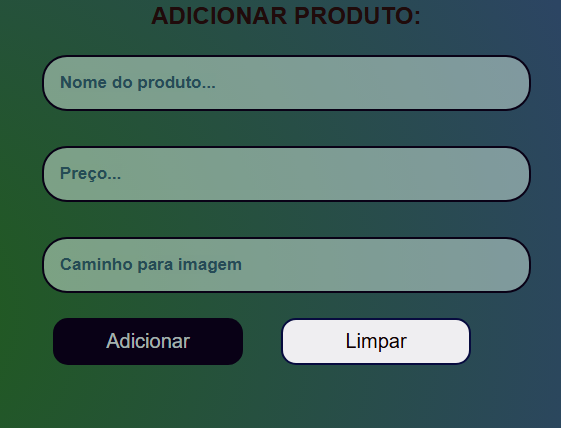
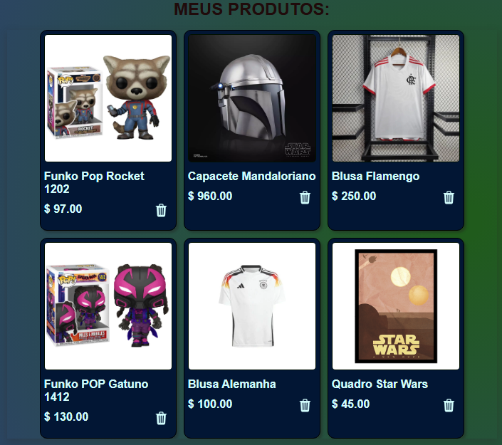

  

Página inicial com seção dos produtos e seção do formulário de cadastro de novos produtos da AluraGeek, uma plataforma de compartilhamento de produtos.

## Link para acessar o site:
<a href="https://mini-loja-geek.vercel.app/">Clique aqui</a>

## Tecnologias utilizadas durante o projeto
* Javascript
* NodeJS
* Json-server

## Tecnologias utilizadas no projeto
* HTML
* CSS

## Screenshots

